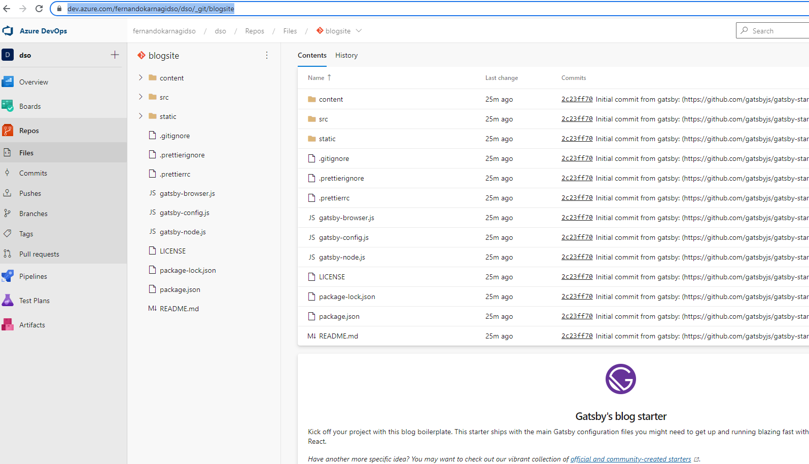
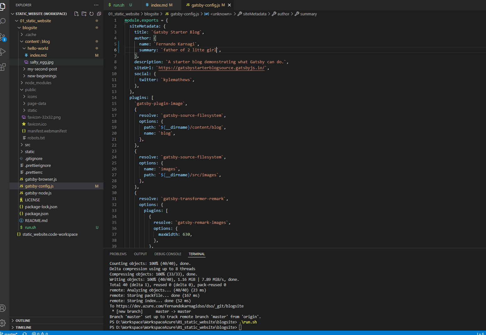
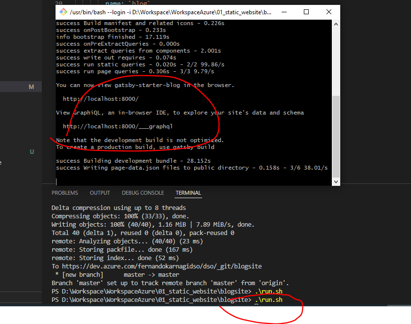
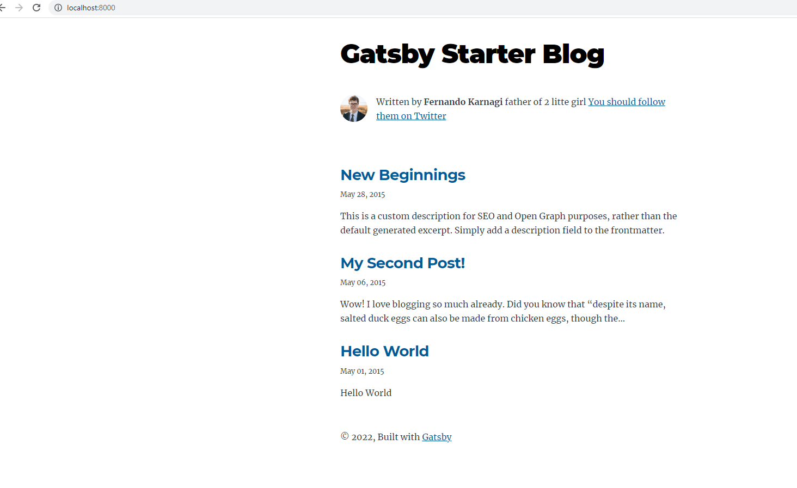

# Reference

<https://itnext.io/the-only-guide-you-need-for-a-static-website-in-azure-part-1-create-a-static-website-da00ddc85f2d>

# Work

## Source code is hosted in this AzDO Git Repo

<https://dev.azure.com/fernandokarnagidso/dso/_git/blogsite>

## This is the local VSS code

## Test running locally

## Test result

