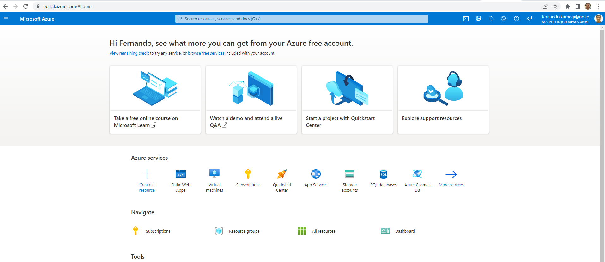
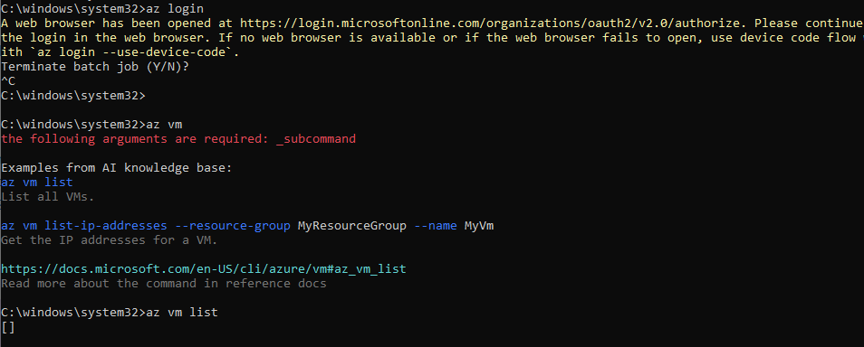
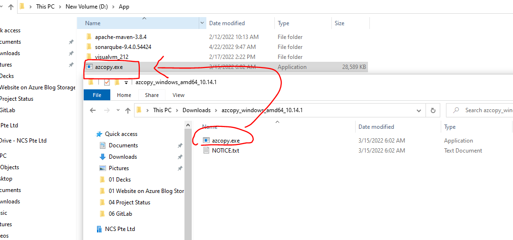

# Reference 

<https://itnext.io/the-only-guide-you-need-for-a-static-website-in-azure-part-2-host-your-static-site-in-azure-9114b7069db2>

# Azure subscription

For this guide you need an Azure subscription, with a native user account that has the rights to create and edit an Azure Storage Account, and upload the static website build to this account.

### Use <Fernando.karnagi@ncs.com.sg> Azure account

<https://portal.azure.com/#home>

# Work

## Azure CLI

In this guide you'll use the Azure Cloud Shell for Azure CLI. However, if you prefer to work from your local workstation you can install the Azure CLI locally.

### Follow this tutorial
<https://docs.microsoft.com/en-us/cli/azure/install-azure-cli>

## AzCopy

In this guide you'll upload files and directories to the Blob storage account by using the AzCopy command-line utility. Go to the "Getting started with AzCopy" page for the installation files and guide on how to install AzCopy.

### Follow this tutorial
<https://docs.microsoft.com/en-us/azure/storage/common/storage-use-azcopy-v10>

