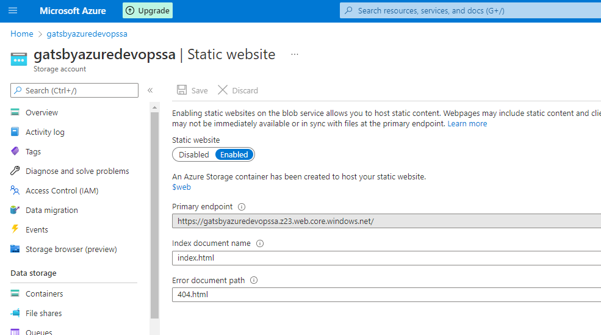

# Reference

<https://itnext.io/the-only-guide-you-need-for-a-static-website-in-azure-part-2-host-your-static-site-in-azure-9114b7069db2>

# Work
 
## Create resource group

<https://docs.microsoft.com/en-us/azure/azure-resource-manager/management/overview#resource-groups>

``` az group create \--name gatsby-azuredevops-rg \--location southeastasia ```


### Check the group in the Azure Portal

 

 

## Create Storage Account

``` az storage account create \--name gatsbyazuredevopssa \--resource-group gatsby-azuredevops-rg \--location southeastasia \--sku Standard_LRS ```

 

 

### Check in the Azure Portal

 

## Enabling Static Website Feature

### Now you have a storage account, you need to enable the static website feature. You can do that by executing the following command

``` az storage blob service-properties update \--account-name gatsbyazuredevopssa \--static-website \--404-document 404.html \--index-document index.html```

 

 

### Check in the Azure Portal

 

## Details configuration

 
