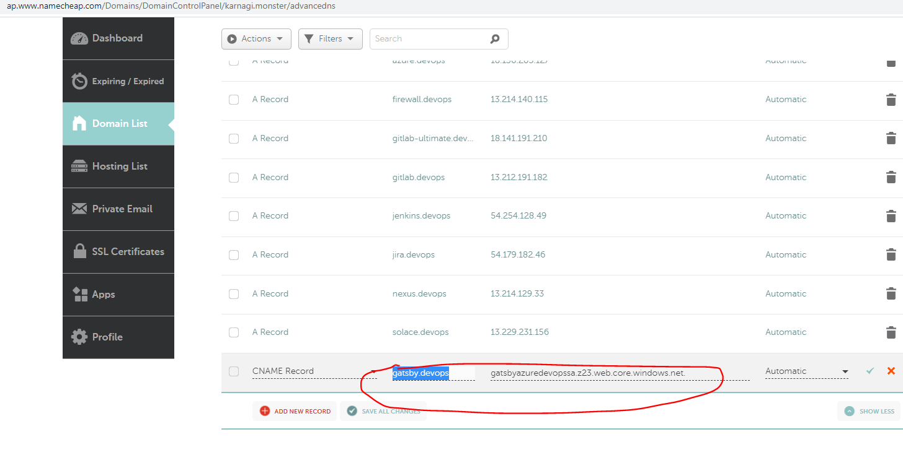

# Reference

<https://itnext.io/the-only-guide-you-need-for-a-static-website-in-azure-part-2-host-your-static-site-in-azure-9114b7069db2>

``` az cdn profile create \--name gatsby-azuredevops-cdnp \--resource-group gatsby-azuredevops-rg \--location southeastasia \--sku Standard_Microsoft ```

 

# Work

### Check in Azure Portal

 

Now that the CDN profile has been made, we can now create a CDN endpoint to serve content over HTTP and HTTPS. Create the endpoint using the following command in Azure CLI (or use the portal)

``` az cdn endpoint create \--name gatsby-azuredevops-cdne \--resource-group gatsby-azuredevops-rg \--profile-name gatsby-azuredevops-cdnp \--origin gatsbyazuredevopssa.z23.web.core.windows.net ```

## Now associating that with Domain

### Create CNAME in Domain Provider

  

## Now, create custom domain to the CDN

 

### Click 'Add' button and you should be able to see the custom domain is created

 
