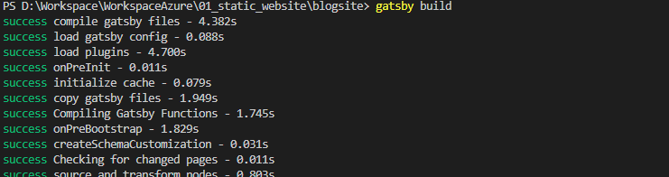
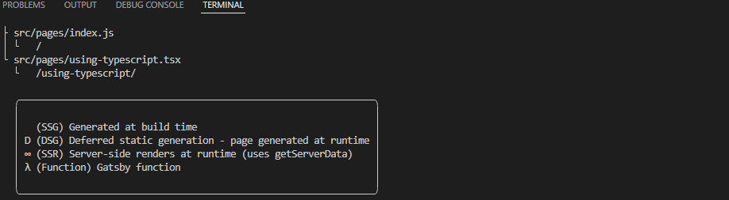
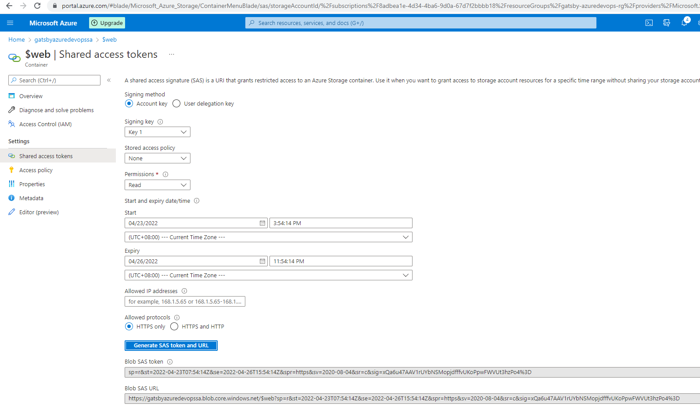
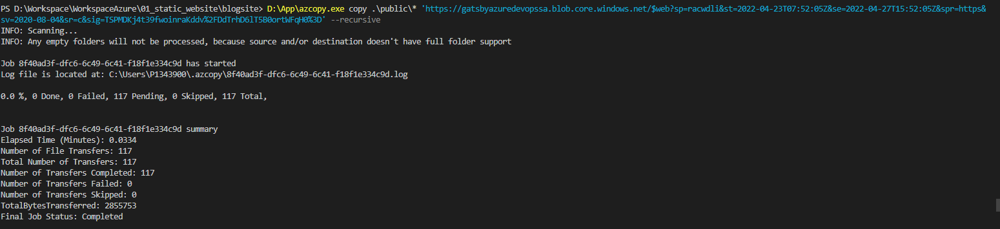

# Reference 

<https://itnext.io/the-only-guide-you-need-for-a-static-website-in-azure-part-2-host-your-static-site-in-azure-9114b7069db2>

# Work

## First all, lets compile the Gatsby

 

 

### Now, create SAS 

 

### Next, we are now going to upload our static website to the storage account. For this we use AzCopy from the POWERSHELL

 
